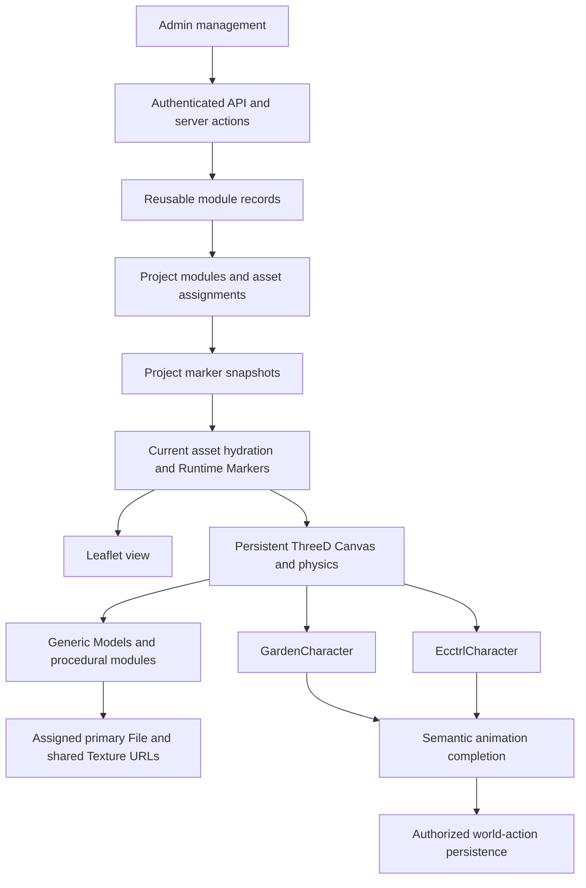

# App overview analysis — v0.19.11

Baseline: application release `9cdc78e`, documentation release `3c86b86`, package `0.19.11`. Both releases were confirmed in production by the User. The working tree was clean at the start of this review.

## Assessment

The App has a substantial working foundation, especially its newer Project/ThreeD workflows. The next valuable step is a bounded reliability and access-control pass across the existing product, before adding another major feature family. Recent ThreeD improvements should be preserved and extended to the remaining paths, not replaced with a new architecture.

The immediate follow-up is current file authority after generic Model/Planting position updates (A05, fixed locally below). Older maintenance endpoint authorization remains an active finding. The User deferred Registration and Settings; unused Tasks and Analytics are removed from the improvement roadmap. App route removal is a separate scope clarification and has not been performed.

This is a repository-wide overview with representative implementation review, not an exhaustive line-by-line security audit or a live production certification. Inventory: **61 page routes, 105 API route handlers, 546 TypeScript source/validator files**. Source review covered navigation/authentication, Projects, Model lifecycle, Scene state, Characters/world actions, gardening, Traffic, Music, Settings, integration boundaries and deployment/validation. Tests used local fixtures. No live API mutation, database connection, Blob inspection, external provider call, build or deployment was performed.

Evidence labels below distinguish **confirmed source behavior**, **offline reproduction**, **coverage/design gaps**, and **live verification needed**. A passing TypeScript check does not establish authorization correctness, UI usability or successful production persistence.

## Functionality overview

| Area | Existing functionality / evidence | Main next concern |
| --- | --- | --- |
| Authentication | Auth.js credentials sign-in with bcrypt comparison, JWT sessions, sign-out/error pages; authenticated Admin presentation | Registration does not create accounts; configured sign-in path differs from actual route; server actions/routes must authorize independently of the client layout |
| Projects and onboarding | Owner-scoped Project CRUD, templates, module/asset assignments, calibration, guided setup, public/owner discovery | Two-user/private/public testing across all loaders; consistent current-asset hydration after edits |
| ThreeD Models | Single and bulk FBX/GLB/GLTF/OBJ imports, bounded preparation, dependencies, previews, primary File relationship, reusable Textures, sortable table and deletion | Remaining stale position responses; first-200 management limit; asset-repair visibility at scale |
| Model Files/storage | Primary registration, dependency audit, existing shared Texture links, unique readable Blob paths and legacy URL support | Inventory/backup/restore procedure; old unresolved records remain intentionally unrepaired |
| Scene/Map | 2D/3D views, stable Runtime Markers, persistent Canvas/physics, Layers, saved positions/views, explicit placement and DetailsCard editing | Regression coverage across all module edits; measured rendering/memory performance |
| Characters | Separate Garden and Ecctrl runtimes, external animations, control/camera behavior, semantic action mapping, corrected FBX texture resolution and Save Position | Character load errors do not publish to the generic DetailsCard error registry; preserve runtime separation |
| Gardening | Plants, Beds, Plantings, Watering Schedules, Harvests and weather/logs; targeted Water and harvest persistence | Verify schedule semantics, timezone behavior and Project-filtered totals live |
| Traffic | CHP live/history, Caltrans closures/CCTV/districts, 511 and CalFire pages, pollers and map integration | Unprotected poll/cron paths, obsolete coordinate maintenance routes, freshness and failure visibility |
| Music | Public album/track browsing, direct-file playback, owner-scoped admin CRUD, links/media, polling and playback endpoints | Dedicated functional tests; legacy streaming/sample fallback and playback accounting; scheduler ownership |
| Settings | JSON defaults, client configuration, DB override helpers, Admin Settings form | Form writes the wrong local path; no auth in save action; client/server persistence models diverge |
| FarmBot/MQTT | Credential encryption, owner-scoped configuration, read-only MQTT architecture and policy/worker validation | Two validators blocked by local Bun launcher; live read-only worker health unknown; physical command gates remain intentional |
| Release operations | GitHub validation, Vercel release workflow, versioned release notes; v0.19.11 deployment confirmed | Persistent browser/API regression suite, compatible rollback/restore evidence, consolidated current documentation |

“Existing” means implemented paths were found, with local or prior User evidence where stated. It does not mean every listed workflow was exercised live during this audit. Public Music and Traffic also have standalone dashboards; not every Dashboard route is Project-scoped despite the broad wording in historical architecture notes.

## Architecture to preserve

Reusable asset definitions and Project-instance transforms are separate responsibilities. `threed_models.main_model_file_id` selects the actual primary File; Model URLs must not regain authority through saved JSON. Shared Texture reuse must not become duplicate Blob uploads. Fallbacks must remain visual recovery, not substitute collision geometry. Settings, polling and authentication need clearer policies without merging the separate Character runtimes or rebuilding the Scene lifecycle.

## Prioritized findings

### A01 — Unprotected legacy mutation and polling routes

**Priority: P1, first corrective stage. Evidence: confirmed source behavior; production reachability/data effects not exercised.**

`src/app/api/traffic/caltrans/closures/add-test-coordinates/route.ts:7` performs database updates from an unauthenticated GET. `.../update-coordinates/route.ts:8` accepts an unauthenticated POST and updates coordinates by supplied closure ID. Neither has an environment guard. These routes target `lane_closures`, while the current Drizzle table is `traffic_caltrans_lane_closures`; whether the legacy table still exists in production was not checked. If it does, the routes can modify it; if it does not, they are broken maintenance endpoints. No application middleware/proxy protection was found.

CHP CAD, Caltrans, CalFire and 511 cron routes invoke pollers without authorization. `src/app/api/threed/weather/poll/route.ts` also invokes an inserting poller from GET without auth. `src/app/api/music/cron/route.ts:10` checks its bearer token only when `CRON_SECRET` exists, allowing calls if configuration is absent.

**Next change:** remove or development-gate obsolete maintenance endpoints; separate authenticated manual actions from secret-authenticated scheduler actions; fail closed when scheduler configuration is missing. Do not depend on `/admin` layout gating to protect API handlers.

**Acceptance:** anonymous and wrong-credential calls cause no provider request or DB write; valid scheduled/manual calls work under an explicit policy; GET diagnostic endpoints are read-only; legacy table paths are removed or deliberately supported. Test with mocked provider/DB clients, not live writes.

### A03 — Account registration is not implemented behind the form

**Deferred by User: registration. Original priority: P1 before onboarding additional users. Evidence: confirmed source control flow.**

`src/app/auth/sign-up/page.tsx:42` calls `signIn('credentials', { action: 'signup', ... })`. `src/lib/auth/index.ts:27` only looks up an existing User and credentials account and verifies its password; it never handles `action` or creates records. An unknown email therefore returns authentication failure. Repository search found no alternate registration handler used by this form.

Additionally, Auth.js config points to `/sign-in` (`src/lib/auth/index.ts:100`), while the existing page is `/auth/sign-in`; no corresponding rewrite or `/sign-in` page was found.

**Next change:** implement an authorized/validated registration policy, or explicitly present invite-only onboarding if self-registration is not intended. Align configured routes. This requires a product choice about who can create an account, not a new Model feature.

**Acceptance:** a new permitted user can register, sign in, sign out and return; duplicate/invalid credentials are handled safely; password hashing and account creation are atomic; redirects target actual routes. Add automated negative-path tests.

### A04 — Settings save path and authority are inconsistent

**Deferred by User: Settings as a whole. Original priority: P1 for the save-action authorization; P2 for persistence redesign. Evidence: confirmed source behavior and filesystem inspection.**

`src/app/admin/settings/page.tsx` exposes a server action calling `updateSettings` without an auth/authorization check. The surrounding Admin layout is a client session gate. `src/lib/config/settings.ts:138` writes to `<cwd>/lib/config/settings.json`, but the checked-in file is `<cwd>/src/lib/config/settings.json`; the target directory/file does not exist in this workspace. Consequently the current save path cannot update the loaded source file here.

The client imports static JSON (`settings.client.ts`), while server helpers include cached JSON and separate database override support. Changing a process cache or local source file does not establish a durable shared setting or refresh the already bundled client configuration. Production filesystem behavior was not tested.

**Next change:** choose global administrative settings versus per-user preferences, enforce that authority in the action, and use the existing appropriate persistent settings mechanism. Do not treat changing the path string alone as a complete fix.

**Acceptance:** unauthorized calls are rejected; a successful save survives process restart/redeployment and is reflected consistently in a new client session; validation errors preserve existing configuration.

### A05 — Stale primary URLs after generic Model/Planting edits — fixed locally

**Priority: P1 for the current ThreeD workflow. Evidence: confirmed source behavior plus offline reproduction.**

Before this follow-up, the Character update branch refreshed its related Model/Files. The Planting branch at `src/app/api/project/threed-markers/route.ts:1276` spread stored `currentData` into the result. The generic Model branch at line 1389 refreshed only `fallbackShape` and retained other stored fields. If marker JSON contains an old primary URL or nested Model, that response carries it back to the browser.

An offline fixture using the actual `applyThreeDProjectClientTransaction` function reproduced both cases: a current URL in client state was replaced by `https://fixture.test/deleted.fbx` after a position response containing stale saved JSON. This is not a live production mutation or a claim that all saved records contain stale URLs.

**Local implementation:** both position update branches now read accessible current Model/File records inside the save transaction. Generic Models overwrite snapshot URL, size, primary ID and attachments, including empty values. Plantings resolve their current custom Model, otherwise their Plant’s current Model; missing/inaccessible assignments return `model: null`. Instance transforms and stable marker identity remain intact. This follow-up is not deployed.

**Validation:** TypeScript, Runtime Marker, Library placement and Project session validators pass after this fix. Fixtures cover repeated saves, removed assignments, current Planting selection and unchanged unrelated owner data. No live database request or browser verification was performed.

**Manual acceptance:** replacing/removing a primary, loading a Project, moving/saving twice, and reloading never requests the obsolete URL for Models, Characters or Plantings. Exercise missing/deleted source records and ensure unrelated markers are not remounted.

### A06 — Models management silently operates on only 200 records — fixed locally

**Priority: P2, increasingly important with bulk import. Evidence: confirmed source behavior.**

Before this follow-up, `ThreeDModelsCRUD.tsx:226` fetched `?limit=200` and stores only the returned page. Search/sort operate on that local array (`:247`), with no pagination traversal. Models outside the first page are therefore absent from the management table/search and cannot be selected there. The API parses `limit` directly without a maximum/finite-positive validation at `src/app/api/threed/models/route.ts:272`.

**Local implementation:** Admin Models uses server pagination (25/50/100/200 per page), total/range counts and First/Previous/Next/Last navigation. Search and all seven column sorts apply before pagination. ID breaks ties; missing sizes stay last. Selection is page-local and clears on query/page changes. Stale list requests are aborted/ignored and deleting the final page’s last row falls back to a valid page. TypeScript and the offline query-input validator passed; live 200+ Model browser acceptance remains manual. Other Model pickers retain their existing limits and are outside this change.

**Acceptance:** a fixture with more than 200 Models can locate and edit the last record, sort consistently across pages, and delete only the intentionally selected set. Invalid/oversized pagination inputs return bounded responses.

### A07 — DetailsCard load-error coverage is generic-Model-only

**Priority: P2. Evidence: confirmed producer/consumer mismatch.**

DetailsCard checks the transient Model failure registry for generic Models and nested Character/Planting Models (`DetailsCard.tsx:27`). Only `ModelMarker3D.tsx` publishes failures. GardenCharacter and EcctrlCharacter do not. A Character with an empty URL is correctly flagged from data, but a Character whose nonempty URL fails to load can show its cylinder without the corresponding DetailsCard load-failure message.

**Next change:** have each owning visual publish/clear compatible error state without replacing existing default meshes or altering movement/physics. Prefer a small shared reporting contract over a new global placeholder system.

**Acceptance:** missing URL, 404, malformed asset, retry/recovery, URL replacement and unmount produce accurate selected-marker messages in both Character paths; successful assets and intentionally procedural items have no false warning.

### A08 — Polling operations need an explicit scheduling and freshness contract

**Priority: P2 after A01. Evidence: implementation gap; production scheduler configuration unknown.**

Music exposes start/stop operations around a process-local `setInterval` and `isPolling` flag (`MusicPoller.ts:362`). Those mechanisms alone do not coordinate multiple processes or prove that a schedule survives process replacement. No root Vercel scheduler configuration is checked in; an external scheduler may exist and was not inspected.

**Next change:** document the actual scheduler/worker owner, use authenticated one-shot polling or the designated long-running worker, and surface last success/failure and stale-data state. Define concurrency and retry policy per provider.

**Acceptance:** process replacement, concurrent triggers, provider timeout and failed credentials produce predictable behavior and visible status. No duplicate ingestion is inferred from a process-local lock. Keep FarmBot read-only/physical-operation boundaries explicit.

### A09 — Music retains alternate paths with inconsistent behavior

**Priority: P2/P3 after core access and onboarding fixes. Evidence: source review; primary player uses direct file URLs.**

The main `MusicContent` player assigns `currentTrack.fileUrl` directly. The separate `/api/music/stream/[trackId]` route requires authentication, permits a non-owner based on album `isPublic` alone, increments play count with a read-modify-write, and redirects to sample audio when S3 is not configured—even outside development. The playback tracking POST independently increments track counts and accepts IDs without checking the referenced track's visibility/album relationship.

These are inconsistencies in alternate endpoints, not proof that the current public player is broken. Do not replace the working direct-file flow without checking real media requirements.

**Next change:** decide the authoritative playback/access/counting contract; retire test fallbacks from production paths; validate associations; test anonymous public playback, private albums and seek/range behavior with representative media.

**Acceptance:** one user action produces the intended accounting, inaccessible tracks cannot be tracked/streamed through alternate routes, and missing media never silently plays an unrelated sample.

### A10 — Model caches and large Scene paths warrant measurement

**Priority: P2 measurement, P3 refactoring. Evidence: source risk, not a measured performance incident.**

`ModelMarker3D` and GardenCharacter retain module-level model caches with no size bound/eviction found. Import previews and multiple attachment revisions can create distinct cache keys. Large orchestration files include `ThreeDScene.tsx` (~2,959 lines), Dashboard Map (~2,809), EcctrlCharacter (~2,655), and GardenCharacter (~2,192). File size alone is not a defect and does not justify merging or rewriting runtimes.

**Next change:** establish representative asset budgets and measure load duration, heap/GPU retention, frame time, request counts and repeated Project switching. Introduce cache/resource lifecycle changes only after defining ownership and verifying skeleton/material sharing behavior.

**Acceptance:** repeated Project/preview switching stabilizes memory and request counts; disposal never invalidates another live instance; Layers and physics remain persistent. Do not treat the user's earlier hard reboot as evidence of an App memory leak.

### A11 — Cross-App validation and recovery evidence are uneven

**Priority: P2, part of each corrective stage. Evidence: repository coverage review.**

The checked-in automated scripts strongly cover ThreeD pure contracts and import logic. No committed Playwright/Vitest/browser regression configuration was found; this does not negate historical one-off browser testing. Authentication, Settings, Music and Traffic workflows lack equivalent dedicated package-script coverage. Two worker-related validators could not start under the current local Bun launcher.

The database/Blob relationship is now materially better organized, but an end-to-end backup inventory and tested compatible restore procedure were not established by this audit. Rolling back old application code after the primary-column removal is not automatically safe.

**Next change:** add a small reproducible browser/API regression suite using fixtures and a two-user access matrix. Document paired database/Blob backup and recovery ownership and rehearse a non-production restore when separately authorized. Resolve the local Bun installation issue without interpreting it as a device integration defect.

**Acceptance:** CI covers the high-value journeys and denial cases; repair/recovery evidence records the code/schema compatibility; no live mutation is needed to run ordinary tests.

### A12 — Documentation mixes current state and historical plans

**Priority: P3; index corrected during this audit. Evidence: confirmed documentation drift.**

At baseline, `docs/README.md` called beta `0.19.10b` current and said OBJ remained deferred, despite released centaur and v0.19.11. `CONTEXT.md` has an up-to-date table but a later sentence still called centaur the current release. Some historical sections describe restrictions superseded by later releases.

**Next change:** keep one short current-state summary linking to immutable release histories and clearly label historical implementation notes. This audit updates only the top-level documentation index needed to discover the report; a broad documentation rewrite is not included.

**Acceptance:** the documentation entry point, package version, current-production table and release index agree; historical statements cannot be mistaken for current runtime contracts.

## Items deliberately not reported as current failures

- Two “Coming Soon” CHP components exist, but no active import consumer was found; actual CHP live/history routes load other implemented components. TODO text alone is not proof of broken UI.
- An Admin client layout accepting any signed-in user is not itself proof of an authorization bug: the App provides owner-scoped self-service management. The concrete gaps are at specific server actions/endpoints.
- Intentionally disabled FarmBot physical command routes are a preserved safety boundary, not an unfinished feature to enable casually.
- Existing unresolved Model records are accepted under the User's no-backfill decision. They should be visible and repairable, not silently migrated.
- Source-level lack of a scheduler file, rate limiter or telemetry integration does not prove the hosting environment lacks external controls. Those controls were not inspected.
- A missing image requirement and a saved Base Color assignment are distinct contracts; automatic matching should not waive unrelated material/buffer requirements.

## Validation performed

Fresh audit run: **20 passed, 2 could not start**, across TypeScript and every `validate:*` script in `package.json`.

| Command (`npm run …`) | Result |
| --- | --- |
| `typecheck` | Pass |
| `validate:assets` | Pass |
| `validate:threed-runtime-markers` | Pass |
| `validate:threed-orchestration` | Pass |
| `validate:project-templates` | Pass |
| `validate:threed-library-placement` | Pass |
| `validate:threed-project-session` | Pass |
| `validate:farmbot-crypto` | Pass |
| `validate:threed-mqtt` | Blocked before validator startup: Bun snap launcher permission failure |
| `validate:farmbot-worker` | Blocked before validator startup: same launcher failure |
| `validate:farmbot-mqtt-persistence` | Pass |
| `validate:farmbot-command-policy` | Pass |
| `validate:threed-model-import` | Pass |
| `validate:threed-model-bulk-preparation` | Pass |
| `validate:threed-model-bulk-runner` | Pass |
| `validate:threed-fbx-material-targets` | Pass |
| `validate:threed-gltf-bundle` | Pass |
| `validate:threed-gltf-material-targets` | Pass |
| `validate:threed-obj-bundle` | Pass |
| `validate:threed-model-blob-paths` | Pass |
| `validate:threed-bulk-saved-texture` | Pass |
| `validate:threed-model-bulk-preview` | Pass |

The blocked commands emitted `snap-confine is packaged without necessary permissions` / missing permitted `cap_dac_override` before running tests. No escalation or worker start was attempted. Additional offline reproduction verified A05 using the actual client transaction helper. Filesystem inspection verified the A04 Settings target mismatch. Documentation diff/link checks were performed after writing this report.

No `npm run build`, schema change, production request, account creation, provider polling, credential inspection or deployment was performed. There was no new browser/visual test in this audit.

## Recommended next work, in order

| Stage | Concrete deliverable | Exit criteria |
| --- | --- | --- |
| 1. Access and maintenance routes | A01; a route access-policy matrix | Anonymous/other-user rejection and allowed public reads proven with tests; no unauthenticated poll/write path in reviewed families |
| 2. Scene file authority | A05 current references on every position response (implemented locally) | Generic Model/Planting edits never resurrect old assets; verify replacement/removal and two consecutive saves in the browser |
| 3. Asset management at scale | A06 pagination; A07 complete DetailsCard failures; focused missing-primary/dependency filters using existing UI | More than 200 Models manageable; every relevant failure leads to a working repair flow; existing fallback meshes preserved |
| 4. Operational reliability | A08 scheduling/freshness; A10 measured cache ownership; A11 repeatable browser checks and restore planning | Measured stable switching/load budgets, visible polling failures, reproducible tests and a reviewed recovery runbook |
| 5. Module polish | A09 Music consistency, Traffic UX, A12 documentation consolidation | Main user journeys and alternate routes agree; navigation/empty/error states are clear |

Keep stages small and independently reviewable. No new version, implementation approval, schema migration, physical command capability or external resource is designated by this analysis. My recommendation is to begin with Stage 1, while treating the narrow A05 Scene fix as the highest-priority ThreeD-specific correction.

## Live verification still needed

Use a disposable Project and separately authorized test accounts/data for a complete acceptance run: sign in with an existing account, create Project, assign each module, import/replace/remove primary assets, save positions twice, toggle Layers, exercise Character control/actions, reload, and verify private/public/other-user views. Also test a 200+ Model library, mobile/narrow layouts, keyboard focus, provider failure/freshness, direct Music playback and recovery. Record browser errors, request timings and observed results rather than extrapolating from static checks.
